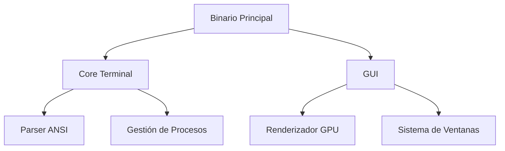

# Arquitectura de NovaTerm

## Módulos Principales

### `core`
- **Responsabilidad**: Lógica pura de terminal
- **Dependencias**: 
  - `nom`: Parsing ANSI
  - `tokio`: Ejecución async de procesos

### `gui`
- **Stack Técnico**:
  - `iced`: Renderizado declarativo
  - `glow`: Abstracción OpenGL/Vulkan
  - `cosmic-text`: Layout de texto avanzado