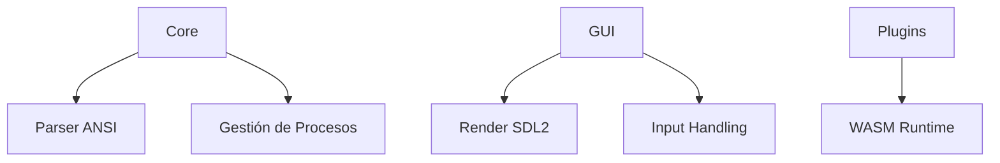

# Arquitectura de NovaTerm

## Principios
- **Minimalismo**: 0 dependencias externas excepto SDL2
- **Seguridad**: Sandboxing via Landlock (Linux)
- **Extensibilidad**: API semántica v1 desde el inicio