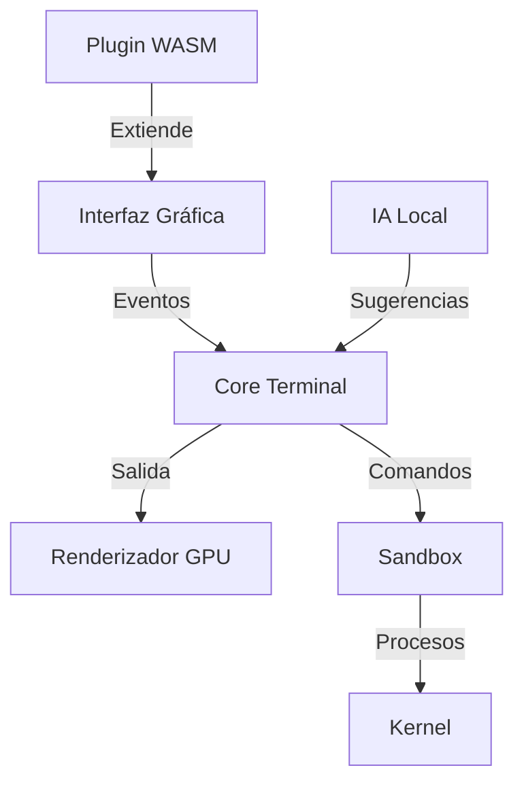

# NovaTerm: La Terminal del Futuro (Escrita en Rust) 🦀
[](https://www.gnu.org/licenses/gpl-3.0)
[](https://github.com/tu-usuario/novaterm-rs/releases)
[](https://github.com/tu-usuario/novaterm-rs/actions)

Una terminal moderna y segura con IA integrada, colaboración en tiempo real y renderizado GPU acelerado. **Alternativa open-source** a Warp Terminal.

<p align="center">
  
</p>

## Características Principales ✨

- **🦾 IA Integrada**: Usa modelos locales (LLaMA2, Mistral) para autocompletado inteligente
- **🤝 Colaboración**: Edita y depura con otros devs en tiempo real usando protocolo CRDT
- **🚀 Rendimiento**: Renderizado GPU a 120 FPS con Iced (OpenGL/Vulkan)
- **🧩 Plugins WASM**: Extiende funcionalidad con módulos seguros en WebAssembly
- **🔒 Seguridad First**: Sandboxing de procesos y enmascaramiento de API keys

## Instalación ⚙️

### Requisitos
- Rust 1.70+
- OpenGL 3.3+
- Python 3.10 (para módulos de IA)

### Desde Cargo
```bash
cargo install novaterm-rs --git https://github.com/tu-usuario/novaterm-rs
```

### Binarios Pre-compilados

| SO       | Comando                            |
|----------|------------------------------------|
| Linux    | `curl -sL novaterm.dev/install.sh | bash` |
| macOS    | `brew tap novaterm/rs && brew install novaterm` |
| Windows  | `winget install novaterm` (próximamente) |

## Uso Rápido 🚀

```bash
# Ejecutar con soporte de IA
novaterm --ia local
# Modo colaboración (comparte sesión)
novaterm join sala-123@novaterm.dev
# Personaliza el tema
novaterm theme install solarized-dark
```

## Arquitectura Técnica 🧠



**Tecnologías Clave**:
- GUI: [Iced](https://iced.rs/)
- Concurrencia: [Tokio](https://tokio.rs/)
- IA: [tch-rs](https://github.com/LaurentMazare/tch-rs)
- Colaboración: [automerge-rs](https://github.com/automerge/automerge-rs)

## Contribución 🤝

¡Tu ayuda es bienvenida! Aquí cómo empezar:

1. Clona el repo: `git clone https://github.com/tu-usuario/novaterm-rs`
2. Busca issues con `good first issue`
3. Sigue nuestras [normas de código](docs/CODESTANDARD.md)

**Canales de Comunidad**:
- Discord: [invite.novaterm.dev](https://discord.gg/...)
- Matrix: [#novaterm:matrix.org](https://matrix.to/#/...)

## Licencia 📜

Este proyecto está bajo [Licencia GPL-3.0](LICENSE). Puedes:
- Usar libremente
- Modificar
- Distribuir
- Usar comercialmente (con restricciones)

## Agradecimientos 🙏

- Equipo de [Iced](https://github.com/iced-rs/iced) por la increíble biblioteca GUI
- [Automerge](https://automerge.org/) por la implementación CRDT
- Comunidad Rust por su apoyo constante

---
[Repositorio](https://github.com/tu-usuario/novaterm-rs) | 
[Documentación](https://docs.novaterm.dev) | 
[Twitter](https://twitter.com/novaterm_dev)